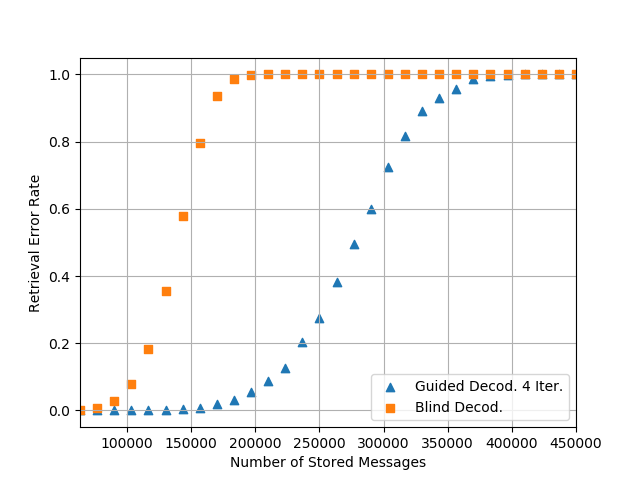

## Sparse Associative Memory (SAM)

In conformity with [reproducible research](https://en.wikipedia.org/wiki/Reproducibility#Reproducible_research) routines this repository reproduces the results of [Storing Sparse Messages in Networks of Neural Cliques](https://ieeexplore.ieee.org/document/6658945/?reload=true&arnumber=6658945).


## Introduction
As an application of this neural network, consider a set of codewords to be sent over a [erasure channel](https://en.wikipedia.org/wiki/Erasure_channel).
SAM can learn the set and recall the entire transmitted codewords from the punctured copies (with missing elements or characters).

[Binary classification](https://en.wikipedia.org/wiki/Binary_classification) is an another example. SAM learns a set of messages and then
it can recall from either partial or noisy messages whether the messages had been learned or not.

## Results

The following results have been used to reproduce Fig. 3 of the above article.
However you may change the simulation parameters through the command-line options (see ```samx --help```).
The code is documented using inline and Doxygen syntax to make it easy to understand and to pave the way
for further developments.

```ntrials```: number of trials to reach ```num_mc``` (equal to 500) errors.

```nmsgs```: number of learned messages i.e. codewords.

```peg```: estimated probability of error for guided recall after ```num_it``` (equal to 4) iterations.

```peg```: estimated probability of error for blind recall.

```
        ntrials          nmsgs            peg            peb

              1         450000              1              1
              1         436667              1              1
              1         423334              1              1
              1         410001              1              1
              1         396668          0.998              1
              1         383335        0.99404              1
              1         370002        0.98619              1
              1         356669        0.95785              1
              1         343336         0.9311              1
              1         330003        0.89127              1
              1         316670        0.81699              1
              1         303337        0.72359              1
              1         290004         0.5988              1
              1         276671        0.49505              1
              1         263338        0.38344              1
              1         250005        0.27503              1
              1         236672        0.20467              1
              1         223339         0.1269              1
              1         210006       0.087581              1
              1         196673       0.055334        0.99856
              1         183340       0.031975        0.98779
              1         170007       0.017782        0.93517
              1         156674      0.0085791        0.79547
              1         143341      0.0041042        0.57943
              3         130008      0.0018123         0.3556
              7         116675     0.00068164        0.18202
             20         103342     0.00025445        0.07941
             85          90009     6.5894e-05       0.028939
            446          76676     1.4639e-05      0.0086214
           3026          63343     2.6087e-06      0.0019565
```

